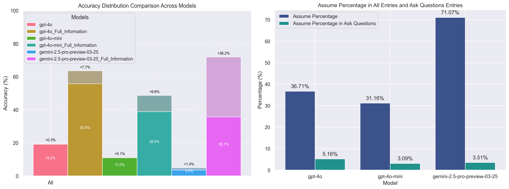

# LLM-Fail-to-Acquire-Context
A Benchmark for Evaluating LLMs' Ability to Request Missing Information in Math Problems

**Blog:** <a href="https://sunset-jupiter-cf3.notion.site/LLM-Fail-to-Acquire-Context-20fb7e977237802ca126ed554ccb8083?pvs=74">
    
</a>
**HF Dataset:** <a href="https://huggingface.co/datasets/Frinkleko/IncompleteQuestionsWithConditions">
    
</a>


[Benchmark](#benchmark) | [Experiments](#experiments) | [Cite](#cite) 

---

A common frustration arises when LLMs provide mismatched implementations or make uncontrolled assumptions, leading to unexpected and undesirable results. This challenge often occurs when LLMs encounter incomplete or ambiguous inquiries, which users may unconsciously provide due to their interaction habits and expectations.

We build a benchmark to investigate this intriguing challenge faced by Large Language Models (LLMs):

1. LLM's tendency to **directly answer** when **curial context is missing** and their **significant performance degradation** as a result.
2. LLM may stuck in a **special type hallucinations-as-assumption** then answer directly when **curial context is missing**, which leads to completely wrong answers.



> (Left) Performance degradation from full context to missing context, even though LLM are explicitly prompted about asking questions. (Right) LLMs' tendency to make wrong assumptions when context is missing, leading to hallucinations and incorrect answers.

## Benchmark

We now offer the large version of this benchmark on HuggingFace, containing 1912 samples.

- **"Incomplete Questions with Conditions" (large) dataset:** [HuggingFace Dataset](https://huggingface.co/datasets/Frinkleko/IncompleteQuestionsWithConditions)

Each sample includes an incomplete question without a condition, the condition itself, the answer, and the original full question from which these components are derived. Here is an example:

```json
{
    "index": 130,
    "question": "Given the sets $A=\\{1,2,3,4\\}$ and $B=\\{x|y=2x,y\\in A\\}$, then $A\\cap B=$\u3000\u3000()\n\nA: $\\{2\\}$  \nB: $\\{1,2\\}$  \nC: $\\{2,4\\}$  \nD: $\\{1,2,4\\}$",
    "new_question": "Given the set $B=\\{x|y=2x,y\\in A\\}$, then $A\\cap B=$\u3000\u3000() A: $\\{2\\}$  B: $\\{1,2\\}$  C: $\\{2,4\\}$  D: $\\{1,2,4\\}$",
    "condition": "$A=\\{1,2,3,4\\}$",
    "answer": "B"
}
```
You can also **test this sample with your LLMs now**, copy the following prompt and send it to your LLM:

```
Given sets b={0,1,2}, then a∩b=（　　）\n\na: {0}\n\nb: {1}\n\nc: {1，2}\n\nd: {0，1，2}. Return answer in \boxed{}.
```

We may add or adjust more representative samples in the future to develop a formal academic benchmark.

## Experiments

Codes `really` coming soon!

## Cite

```bibtex
@misc{shen2025llmfail,
	title={LLM Fail to Acquire Context},
	author={Shen, Xinjie},
	year={2025},
	howpublished={\url{https://sunset-jupiter-cf3.notion.site/Failing-to-Acquire-Context-A-Benchmark-for-Evaluating-LLMs-Ability-to-Request-Missing-Information--20fb7e977237802ca126ed554ccb8083}},
	note={Notion Blog},
}
```